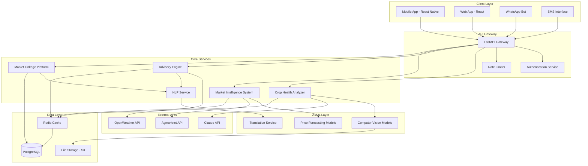

# Design Document: Krishi Mitra

## Overview

Krishi Mitra is a mobile-first AI-powered platform designed to serve Indian farmers with comprehensive agricultural support. The system combines computer vision for crop health diagnosis, natural language processing for multilingual advisory services, time-series forecasting for market intelligence, and a direct market linkage platform to eliminate middlemen.

The architecture prioritizes accessibility for users with varying technical literacy, operates effectively under limited connectivity conditions, and integrates with existing Indian agricultural data infrastructure. The platform addresses critical pain points in Indian agriculture: crop disease management, weather-based farming guidance, market price transparency, and direct farmer-buyer connections.

## Architecture

### System Architecture



### Technology Stack

**Frontend:**
- React Native for cross-platform mobile app
- React for web dashboard
- Progressive Web App (PWA) capabilities for offline functionality

**Backend:**
- FastAPI (Python) for high-performance API services
- Celery for background task processing
- Redis for caching and session management
- PostgreSQL for persistent data storage

**AI/ML:**
- Claude API for natural language processing and crop advisory
- TensorFlow/PyTorch for custom computer vision models
- Scikit-learn for time-series forecasting
- Hugging Face Transformers for multilingual support

**Infrastructure:**
- Docker containers for service deployment
- Railway/Vercel for hosting and auto-scaling
- AWS S3 for image and file storage
- CloudFlare for CDN and DDoS protection

## Components and Interfaces

### Crop Health Analyzer

**Purpose:** Processes crop images to identify diseases, pests, and nutrient deficiencies using computer vision and AI analysis.

**Key Components:**
- Image preprocessing pipeline for quality enhancement
- Disease classification model trained on Indian crop datasets
- Pest identification system using object detection
- Nutrient deficiency analyzer based on leaf color analysis
- Remedy recommendation engine with regional treatment options

**Interfaces:**
```python
class CropHealthAnalyzer:
    def analyze_crop_image(self, image: bytes, crop_type: str, location: str) -> AnalysisResult
    def get_treatment_recommendations(self, diagnosis: Diagnosis, language: str) -> List[Treatment]
    def validate_image_quality(self, image: bytes) -> ImageQualityResult
```

**Integration Points:**
- Claude API for generating contextual treatment advice
- File storage for temporary image processing
- Translation service for multilingual recommendations

### Advisory Engine

**Purpose:** Provides personalized farming recommendations based on weather, soil conditions, and crop requirements.

**Key Components:**
- Weather data integration and analysis
- Crop calendar management system
- Irrigation scheduling optimizer
- Soil health assessment tools
- Crop rotation recommendation system

**Interfaces:**
```python
class AdvisoryEngine:
    def get_weather_advisory(self, location: str, crop_type: str) -> WeatherAdvisory
    def recommend_crop_rotation(self, field_history: List[CropCycle], soil_data: SoilData) -> RotationPlan
    def calculate_irrigation_schedule(self, crop_stage: str, weather_forecast: WeatherData) -> IrrigationSchedule
    def generate_seasonal_calendar(self, location: str, crops: List[str]) -> SeasonalCalendar
```

**Integration Points:**
- OpenWeather API for real-time weather data
- Agmarknet API for market-informed crop selection
- NLP service for multilingual advisory delivery

### Market Intelligence System

**Purpose:** Tracks real-time market prices, generates forecasts, and provides selling recommendations to farmers.

**Key Components:**
- Real-time price data aggregation from multiple mandis
- Time-series forecasting models for price prediction
- Market comparison and recommendation engine
- Price alert system for optimal selling times
- Historical trend analysis tools

**Interfaces:**
```python
class MarketIntelligenceSystem:
    def get_current_prices(self, commodity: str, location: str) -> List[MarketPrice]
    def forecast_prices(self, commodity: str, days: int) -> PriceForecast
    def recommend_selling_time(self, commodity: str, quantity: float) -> SellingRecommendation
    def compare_nearby_markets(self, commodity: str, farmer_location: str) -> MarketComparison
```

**Integration Points:**
- Agmarknet API for official mandi prices
- Data.gov.in for historical price data
- Notification service for price alerts

### Market Linkage Platform

**Purpose:** Connects farmers directly with buyers and aggregators, facilitating transparent transactions.

**Key Components:**
- Farmer profile and produce listing system
- Buyer verification and matching algorithm
- Communication facilitation through WhatsApp/SMS
- Transaction tracking and dispute resolution
- Rating and feedback system

**Interfaces:**
```python
class MarketLinkagePlatform:
    def create_produce_listing(self, farmer_id: str, produce: ProduceDetails) -> ListingId
    def match_buyers(self, listing_id: str) -> List[BuyerMatch]
    def facilitate_communication(self, farmer_id: str, buyer_id: str) -> CommunicationChannel
    def track_transaction(self, transaction_id: str) -> TransactionStatus
```

**Integration Points:**
- WhatsApp Business API for messaging
- SMS gateway for basic phone communication
- Payment gateway integration for secure transactions

## Data Models

### Core Entities

```python
@dataclass
class Farmer:
    farmer_id: str
    name: str
    phone_number: str
    location: Location
    preferred_language: str
    crops_grown: List[str]
    farm_size: float
    registration_date: datetime

@dataclass
class CropImage:
    image_id: str
    farmer_id: str
    image_url: str
    crop_type: str
    upload_timestamp: datetime
    analysis_result: Optional[AnalysisResult]

@dataclass
class AnalysisResult:
    diseases: List[Disease]
    pests: List[Pest]
    nutrient_deficiencies: List[NutrientDeficiency]
    confidence_score: float
    recommendations: List[Treatment]

@dataclass
class MarketPrice:
    commodity: str
    market_name: str
    state: str
    district: str
    min_price: float
    max_price: float
    modal_price: float
    date: date
    arrival_quantity: float

@dataclass
class ProduceListing:
    listing_id: str
    farmer_id: str
    commodity: str
    quantity: float
    quality_grade: str
    expected_price: float
    harvest_date: date
    location: Location
    status: ListingStatus
```

### Database Schema

**Farmers Table:**
- Primary key: farmer_id
- Indexes: phone_number, location
- Relationships: One-to-many with crop_images, produce_listings

**Crop_Images Table:**
- Primary key: image_id
- Foreign key: farmer_id
- Indexes: upload_timestamp, crop_type
- Blob storage reference for actual image files

**Market_Prices Table:**
- Composite key: commodity, market_name, date
- Indexes: commodity, date, state
- Partitioned by date for efficient historical queries

**Produce_Listings Table:**
- Primary key: listing_id
- Foreign key: farmer_id
- Indexes: commodity, location, status, harvest_date

## Correctness Properties

*A property is a characteristic or behavior that should hold true across all valid executions of a system—essentially, a formal statement about what the system should do. Properties serve as the bridge between human-readable specifications and machine-verifiable correctness guarantees.*

### Property-Based Testing Properties

Based on the requirements analysis, the following properties must hold for all valid system executions:

**Property 1: Crop image analysis completeness**
*For any* valid crop image and supported crop type, the Crop_Health_Analyzer should identify all detectable diseases, pests, and nutrient deficiencies with appropriate confidence scores
**Validates: Requirements 1.1, 1.5**

**Property 2: Recommendation prioritization consistency**
*For any* set of detected crop issues, recommendations should always be ordered by severity and urgency, with the most critical issues appearing first
**Validates: Requirements 1.3**

**Property 3: Multilingual content delivery**
*For any* system-generated content and any supported regional language, all recommendations, advisories, and interface text should be properly translated and culturally appropriate
**Validates: Requirements 1.2, 2.5, 5.2**

**Property 4: Weather-based advisory generation**
*For any* valid weather data and crop type combination, the Advisory_Engine should generate relevant farming recommendations for the specified time period
**Validates: Requirements 2.1, 2.4**

**Property 5: Soil-based guidance accuracy**
*For any* valid soil condition data, the Advisory_Engine should provide appropriate crop management guidance that matches the soil characteristics
**Validates: Requirements 2.2**

**Property 6: Crop rotation sequence validity**
*For any* soil health and market condition inputs, suggested crop rotation sequences should be agriculturally sound and economically viable
**Validates: Requirements 2.3**

**Property 7: Market price data consistency**
*For any* valid crop and location combination, returned market prices should be current, complete, and include all required price components (min, max, modal)
**Validates: Requirements 3.1**

**Property 8: Price forecasting temporal bounds**
*For any* price forecasting request, predictions should cover the requested time period (7-30 days) and include confidence intervals
**Validates: Requirements 3.2**

**Property 9: Market comparison optimization**
*For any* set of available markets, the system should recommend the market with the highest price for the farmer's location and transportation constraints
**Validates: Requirements 3.3**

**Property 10: Selling time optimization**
*For any* price trend data and forecast period, recommended selling times should maximize expected farmer returns
**Validates: Requirements 3.4**

**Property 11: Produce listing visibility**
*For any* valid produce listing, it should be discoverable by all verified buyers and aggregators in the appropriate geographic region
**Validates: Requirements 4.1**

**Property 12: Communication channel establishment**
*For any* verified buyer-farmer pair, the system should successfully establish communication through available channels (WhatsApp/SMS)
**Validates: Requirements 4.2**

**Property 13: Transaction pricing transparency**
*For any* transaction, the final price should match the initially displayed price with no hidden fees or unexpected charges
**Validates: Requirements 4.3**

**Property 14: Dispute resolution availability**
*For any* transaction dispute, the system should provide accessible resolution mechanisms and contact information
**Validates: Requirements 4.4**

**Property 15: Offline data accessibility**
*For any* previously cached advisory content and price data, it should remain accessible when internet connectivity is unavailable
**Validates: Requirements 5.3**

**Property 16: Voice guidance completeness**
*For any* major system function, voice-guided navigation and audio instructions should be available for users with low technical literacy
**Validates: Requirements 5.4**

**Property 17: API failure graceful degradation**
*For any* external API failure (Agmarknet, OpenWeather), the system should continue operating with reduced functionality and inform users appropriately
**Validates: Requirements 6.1, 6.2, 6.4**

**Property 18: Data encryption consistency**
*For any* farmer personal information, it should be encrypted using industry-standard methods before storage
**Validates: Requirements 8.1**

**Property 19: Image retention policy compliance**
*For any* uploaded crop image, it should be automatically deleted after processing unless explicit user consent for storage is obtained
**Validates: Requirements 8.2**

**Property 20: Access control enforcement**
*For any* attempt to access farmer contact information, it should only succeed for verified and authorized buyers or system administrators
**Validates: Requirements 4.5, 8.3**

## Error Handling

### Error Categories and Responses

**Input Validation Errors:**
- Invalid image formats or corrupted files
- Unsupported crop types or locations
- Malformed API requests

**External Service Failures:**
- Agmarknet API unavailability or rate limiting
- OpenWeather API failures or quota exceeded
- Claude API service interruptions
- SMS/WhatsApp gateway failures

**System Resource Errors:**
- Database connection failures
- File storage service unavailability
- Memory or processing capacity exceeded
- Network connectivity issues

**Business Logic Errors:**
- Insufficient data for price forecasting
- No buyers available in farmer's region
- Crop analysis confidence below threshold
- Market data staleness exceeding limits

### Error Handling Strategies

**Graceful Degradation:**
- Serve cached data when real-time APIs fail
- Provide basic functionality when AI services are unavailable
- Fall back to SMS when WhatsApp integration fails
- Use simplified recommendations when detailed analysis fails

**User Communication:**
- Display clear error messages in user's preferred language
- Provide actionable steps for resolution
- Offer alternative features when primary functions fail
- Maintain service status indicators

**Retry and Recovery:**
- Implement exponential backoff for API calls
- Queue failed operations for later retry
- Maintain circuit breakers for external services
- Provide manual refresh options for users

## Testing Strategy

### Dual Testing Approach

The testing strategy employs both unit testing and property-based testing to ensure comprehensive coverage:

**Unit Tests:**
- Specific examples demonstrating correct behavior
- Edge cases and boundary conditions
- Integration points between components
- Error conditions and exception handling
- Mock external API responses for consistent testing

**Property-Based Tests:**
- Universal properties that hold across all valid inputs
- Comprehensive input coverage through randomization
- Validation of business rules and constraints
- Data consistency and integrity checks
- Performance characteristics under varied loads

### Property-Based Testing Configuration

**Framework Selection:**
- **Python**: Use Hypothesis for property-based testing
- **JavaScript/TypeScript**: Use fast-check for frontend components
- **Integration Tests**: Use Hypothesis with API testing frameworks

**Test Configuration:**
- Minimum 100 iterations per property test
- Custom generators for agricultural data (crops, weather, prices)
- Shrinking enabled to find minimal failing examples
- Seed-based reproducibility for debugging

**Property Test Tagging:**
Each property-based test must include a comment referencing its design document property:
```python
# Feature: krishi-mitra, Property 1: Crop image analysis completeness
def test_crop_analysis_completeness(crop_image, crop_type):
    # Test implementation
```

### Test Data Management

**Synthetic Data Generation:**
- Crop image datasets with known diseases/pests
- Weather data covering various Indian climate zones
- Market price data reflecting seasonal variations
- User profiles representing different farmer demographics

**External API Mocking:**
- Agmarknet API responses with realistic price data
- OpenWeather API responses for different weather conditions
- Claude API responses for various crop advisory scenarios
- WhatsApp/SMS gateway responses for communication testing

### Integration Testing

**End-to-End Scenarios:**
- Complete farmer journey from registration to produce sale
- Cross-service data flow validation
- Multi-language content delivery verification
- Offline-to-online synchronization testing

**Performance Testing:**
- Load testing with realistic farmer usage patterns
- API response time validation under various conditions
- Database query optimization verification
- Mobile app performance on low-end devices

### Continuous Testing

**Automated Test Execution:**
- Property tests run on every code commit
- Integration tests run on staging environment deployments
- Performance regression tests run weekly
- External API health checks run continuously

**Test Environment Management:**
- Separate test databases with anonymized farmer data
- Staging environment mirroring production configuration
- Test data refresh procedures for consistent testing
- Monitoring and alerting for test failures